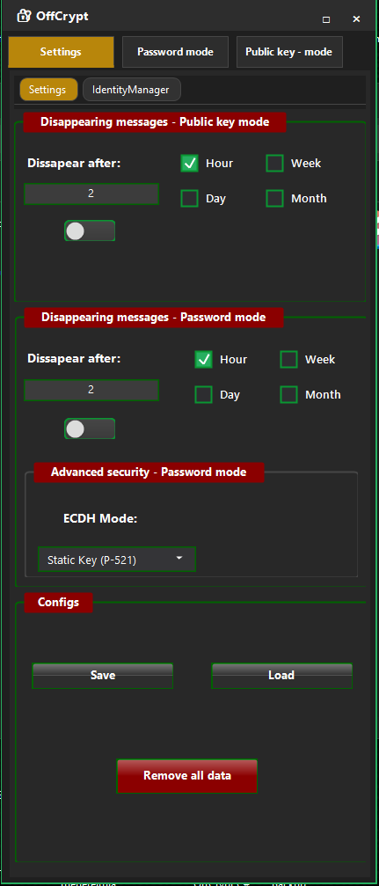

# OffCrypt Desktop - Professional Windows Encryption Suite

[](https://www.gnu.org/licenses/gpl-3.0)
[](https://www.microsoft.com/windows)
[](https://dotnet.microsoft.com/)
[](https://tools.ietf.org/html/rfc7748)

**OffCrypt Desktop** is a professional Windows encryption application providing secure text and file encryption using cutting-edge cryptographic algorithms. Features both password-based encryption (ECDH+HKDF+AES-GCM) and X25519 public-key cryptography with NIST 2024 compliance for maximum security.

🔐 **Fully Offline** • 🔑 **PGP-Style Keys** • ⏰ **Disappearing Messages** • 📁 **File Encryption** • 🛡️ **Zero Data Collection**

## ⚡ Quick Start

### System Requirements
- **OS**: Windows 10 version 1809 or later
- **Framework**: .NET 6.0 or later  
- **Architecture**: x64, ARM64
- **RAM**: 512 MB minimum, 1 GB recommended

### Installation
1. Download the latest release from [GitHub Releases](https://github.com/EmptyCode0x86/)
2. Extract the `.exe` file to your preferred location
3. Run `OffCryptDesktop.exe` as administrator (first time only)
4. Set your master password in Tab 1

### First Steps
1. **Password Mode**: Set master password → Type message → Click "Encrypt"
2. **Public Key Mode**: Generate X25519 keys → Share public key → Import recipient's key
3. **File Encryption**: Create encrypted `.enc` or `.pgp` files for secure storage

## 🔐 Key Features

### Modern Cryptography
- **ECDH + HKDF + AES-GCM**: NIST 2024 compliant password-based encryption
- **X25519 + AES-GCM**: Next-generation public key cryptography
- **Multiple ECDH Curves**: P-256, P-384, P-521, and ephemeral keys
- **Perfect Forward Secrecy**: Session-based key derivation

### Advanced Security
- **Disappearing Messages**: Time-limited secure communication (hours/days/weeks/months)
- **PGP-Style Identity Management**: Contact trust levels and fingerprint verification
- **Memory Protection**: Secure data handling with automatic cleanup
- **Windows DPAPI Integration**: OS-level private key protection

### Professional Features  
- **File Operations**: Create encrypted `.enc` and `.pgp` files
- **Offline-First Design**: No internet connection required or used
- **Attack Protection**: Constant-time operations, replay prevention
- **Complete Data Wipe**: Nuclear option for secure data removal

## 📱 Screenshots

### Main Interface

*Windows encryption software main dashboard showing ECDH+HKDF+AES-GCM configuration and secure messaging interface*

### Password-Based Encryption

*Password-based encryption mode with disappearing messages settings and AES-256-GCM security options*

### X25519 Public Key Mode

*X25519 public key cryptography interface for PGP-style secure communication without servers*

## 📖 Documentation

- **[Complete User Manual](OffCryptDesktop_User_Manual.md)** - Comprehensive guide with step-by-step instructions
- **[How to Use](#how-to-use)** - Quick reference for common operations
- **[Security Best Practices](#security)** - Guidelines for secure usage
- **[Troubleshooting](#troubleshooting)** - Common issues and solutions

## 🛡️ Security & Standards

### Cryptographic Compliance
- **NIST SP 800-56A Rev. 3**: Key establishment standards
- **RFC 5869**: HKDF implementation
- **RFC 7748**: X25519 elliptic curve
- **FIPS 140-2**: Validated cryptographic modules

### Privacy & Security
- **Zero Data Collection**: No telemetry, analytics, or user data stored
- **Open Source**: GPL-3.0 license for full transparency
- **Memory Safety**: Secure handling of passwords and private keys
- **Offline Operation**: No network communication, fully air-gapped

## 🔧 Technical Specifications

### Encryption Algorithms
| Mode | Algorithm | Key Size | Authentication |
|------|-----------|----------|----------------|
| Password | ECDH+HKDF+AES-GCM | 256-bit | Built-in GCM |
| Public Key | X25519+AES-GCM | 256-bit | Built-in GCM |
| Legacy Support | PBKDF2+AES-CBC | 256-bit | HMAC-SHA256 |

### Platform Integration
- **Windows DPAPI**: Secure private key storage
- **Windows Forms/WPF**: Native Windows UI framework
- **Windows Cryptography API**: OS-provided secure random generation
- **.NET 6.0+**: Modern runtime with security enhancements

## 🚀 Development

### Technology Stack
- **Language**: C# (.NET 9.0+)
- **UI Framework**: Windows Forms
- **Cryptography**: Windows Cryptography API, Bouncy Castle
- **Storage**: Windows DPAPI, Registry, INI files

### Building from Source
```bash
git clone https://github.com/EmptyCode0x86/OffCryptDesktop
cd OffCryptDesktop
dotnet restore
dotnet build --configuration Release
```

### Project Structure
```
OffCryptDesktop/
├── Core/              # Cryptographic implementations
├── UI/                # Windows Forms interface
├── Security/          # Memory management & key storage
├── FileOperations/    # Encrypted file handling
└── Documentation/     # User guides and technical docs
```

## 💝 Support & Community

### Get Help
- 📚 **Documentation**: [User Manual](OffCryptDesktop_User_Manual.md)
- 🐛 **Issues**: [GitHub Issues](https://github.com/EmptyCode0x86/OffCryptDesktop/issues)
- 🐦 **Updates**: [@OffCryptAndroid](https://x.com/OffCryptAndroid)

### Support Development
If you find OffCrypt Desktop useful, consider supporting the project:

[](https://ko-fi.com/emptyc0de)

### Contributing
Contributions are welcome! Please read our contributing guidelines and ensure all security-related changes are thoroughly reviewed.

## 📄 License

This project is licensed under the **GNU General Public License v3.0** - see the [LICENSE](LICENSE) file for details.

### Third-Party Acknowledgments
- **Bouncy Castle**: Cryptographic library
- **Microsoft .NET**: Runtime framework
- **Windows Cryptography API**: Secure random generation and key storage

---

**⚠️ Security Notice**: This software is provided as-is for educational and legitimate security purposes. Users are responsible for compliance with local laws and regulations regarding encryption software.

**🔐 OffCrypt Desktop** - *Secure communication without compromise*

---

*Made by [EmptyCode0x86](https://github.com/EmptyCode0x86) | Follow updates: [@OffCryptAndroid](https://x.com/OffCryptAndroid)*